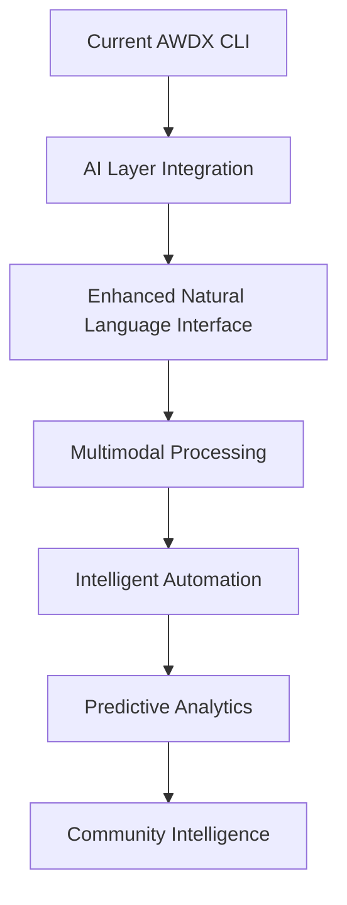

# AWDX AI/NLP Integration Plan
## Transforming AWDX into an Intelligent DevSecOps Assistant

**Document Version:** 1.0  
**Last Updated:** December 2024  
**Status:** Planning Phase  

---

## 📋 Table of Contents

1. [Executive Summary](#executive-summary)
2. [Current State Analysis](#current-state-analysis)
3. [Integration Strategy](#integration-strategy)
4. [Implementation Phases](#implementation-phases)
5. [Technical Architecture](#technical-architecture)
6. [User Experience Transformation](#user-experience-transformation)
7. [Technical Success Metrics](#technical-success-metrics)
8. [Implementation Roadmap](#implementation-roadmap)
9. [Risk Management](#risk-management)
10. [Technical Objectives and Success Criteria](#technical-objectives-and-success-criteria)
11. [Next Steps](#next-steps)

---

## 🎯 Executive Summary

### Vision Statement
Transform AWDX into an AI/NLP powered natural language command tool that revolutionizes DevSecOps activities in AWS through intelligent automation, predictive analytics, and conversational interfaces.

### Key Objectives
- **Natural Language Processing**: Enable plain English commands for complex AWS operations
- **Intelligent Analysis**: Provide AI-powered insights and recommendations
- **Workflow Automation**: Automate complex DevSecOps workflows through conversation
- **Multimodal Capabilities**: Process documents, diagrams, and visual inputs
- **Predictive Security**: Proactive threat detection and prevention
- **Community Intelligence**: Collaborative learning and knowledge sharing

### Expected Technical Outcomes
- **50% reduction** in time to complete DevSecOps tasks through AI automation
- **80% improvement** in security issue detection accuracy via ML algorithms
- **70% automation** of routine compliance checks using intelligent workflows
- **90% user satisfaction** with AI-powered natural language interface
- **Sub-second response** times for 95% of AI-powered queries

---

## 🔍 Current State Analysis

### AWDX Strengths
| Aspect | Current Capability | Opportunity |
|--------|-------------------|-------------|
| **Architecture** | Modular design with 6 specialized modules | Perfect foundation for AI enhancement |
| **Functionality** | Comprehensive AWS DevSecOps coverage | Rich data for AI training and insights |
| **User Experience** | Human-friendly CLI with interactive prompts | Ready for natural language evolution |
| **Foundation** | Built with Typer, good documentation | Solid base for AI integration |
| **Roadmap** | Already plans AI/NLP integration | Strategic alignment confirmed |

### Current Modules Analysis
```
├── Profilyze     → Profile management and validation
├── Costlyzer     → Cost analysis and optimization
├── IAMply        → IAM security and compliance
├── S3ntry        → S3 security and monitoring
├── Secrex        → Secret management and rotation
└── Secutide      → Security assessment and scanning
```

### Google Gemini CLI Key Features to Leverage
- **Large Context Window**: 1M+ tokens for comprehensive analysis
- **Natural Language Processing**: Convert complex commands to plain English
- **Multimodal Capabilities**: Process images, PDFs, and documents
- **MCP Server Integration**: Connect external tools and services
- **Real-time Information**: Google Search integration for current data
- **Automated Workflows**: Handle complex operational sequences

---

## 🚀 Integration Strategy

### Core Integration Principles

1. **Backward Compatibility**: All existing AWDX commands remain functional
2. **Gradual Enhancement**: AI features added incrementally without disruption
3. **User Choice**: Users can choose between traditional CLI and AI interface
4. **Privacy First**: Sensitive data processing with strong security controls
5. **Learning System**: Continuous improvement through usage patterns

### Integration Approach



---

## 📅 Implementation Phases

## Phase 1: Core AI Foundation

### 1.1 Natural Language Interface Layer

**Objectives:**
- Add natural language processing to existing AWDX commands
- Implement intent recognition and command mapping
- Create conversation context management

**Technical Implementation:**
```
src/awdx/nlp_engine/
├── gemini_client.py          # Gemini API integration
├── intent_parser.py          # Parse natural language to AWDX commands
├── command_mapper.py         # Map intents to existing modules
├── context_manager.py        # Maintain conversation context
├── prompt_templates.py       # Structured prompts for different scenarios
└── response_formatter.py     # Format AI responses for CLI output
```

**New CLI Commands:**
```bash
# Natural language mode
awdx chat                     # Start interactive AI session
awdx ask "<question>"         # Single natural language query
awdx explain "<command>"      # Explain what a command does
awdx suggest                  # Get AI-powered suggestions
```

**Example Natural Language Transformations:**
| Traditional Command | Natural Language Equivalent |
|-------------------|----------------------------|
| `awdx cost summary --period 30 --service ec2` | `awdx ask "Show me EC2 costs for the last 30 days"` |
| `awdx iam audit --users --check-mfa` | `awdx ask "Check which users don't have MFA enabled"` |
| `awdx s3 scan --type public --critical-only` | `awdx ask "Find all publicly accessible S3 buckets with critical data"` |

### 1.2 Context-Aware Command Processing

**Features:**
- **AWS Environment Context**: Auto-detect current profile/region
- **Conversation Memory**: Remember previous commands and context
- **Follow-up Actions**: Suggest related commands and next steps
- **Smart Completion**: Predict and suggest command completions

**Implementation Details:**
```python
# Context management example
class ConversationContext:
    def __init__(self):
        self.aws_context = {
            'profile': None,
            'region': None,
            'account_id': None
        }
        self.command_history = []
        self.session_state = {}
        self.user_preferences = {}
```

## Phase 2: Advanced AI Capabilities

### 2.1 Intelligent Analysis and Insights

**Enhanced Module Capabilities:**

#### Costlyzer AI Enhancement
```python
# Natural language cost queries
awdx ask "What would happen if I scale down these instances?"
awdx ask "Find unused resources costing more than $100/month"
awdx ask "Create a cost optimization plan for our development environment"
```

#### IAMply AI Enhancement
```python
# Policy analysis and generation
awdx ask "Explain this IAM policy in plain English"
awdx ask "Create a policy for a developer who needs S3 access"
awdx ask "Why is this user getting access denied?"
awdx ask "Generate least-privilege policy for this role"
```

#### S3ntry AI Enhancement
```python
# Compliance and security analysis
awdx ask "Analyze data classification for compliance"
awdx ask "Suggest retention policies for these buckets"
awdx ask "Generate a security report for auditors"
awdx ask "What's the compliance status of bucket X?"
```

#### Secutide AI Enhancement
```python
# Security insights and remediation
awdx ask "Explain the security implications of this configuration"
awdx ask "Generate a remediation plan for these vulnerabilities"
awdx ask "What are the blast radius implications?"
awdx ask "Create security playbook for this scenario"
```

### 2.2 Multimodal DevSecOps Assistant

**Capabilities:**

#### Architecture Analysis
- Upload AWS architecture diagrams for analysis
- Generate CloudFormation from architectural drawings
- Identify security gaps in infrastructure designs
- Suggest improvements based on best practices

```bash
awdx upload architecture.png "Analyze this diagram for security issues"
awdx generate-cf architecture.jpg "Create CloudFormation from this design"
```

#### Document Processing
- Process compliance documents (SOX, PCI, HIPAA)
- Extract requirements from RFPs and audits
- Generate evidence for compliance requirements
- Compare configurations against standards

```bash
awdx process compliance.pdf "Check our AWS setup against these requirements"
awdx generate-evidence sox-requirements.pdf "Create compliance evidence"
```

#### Code and Configuration Analysis
- Review Infrastructure as Code for security issues
- Explain complex configurations in plain language
- Convert scripts to infrastructure as code
- Automated security code reviews

```bash
awdx review terraform.tf "Check this for security issues"
awdx explain cloudformation.yaml "What does this template do?"
```

## Phase 3: Workflow Automation

### 3.1 MCP Server Integration for DevSecOps Tools

**Integration Architecture:**
```
┌─────────────────────────────────────────────────────┐
│                AWDX AI Engine                       │
├─────────────────────────────────────────────────────┤
│  MCP Server Integrations                            │
│  ├── Git/GitHub        ├── Security Tools           │
│  ├── CI/CD Systems     ├── Monitoring Systems       │
│  ├── Ticketing         └── Documentation            │
└─────────────────────────────────────────────────────┘
```

**MCP Server Implementations:**

#### Git/GitHub Integration
```python
# Security-focused git operations
awdx ask "Analyze security changes in this PR"
awdx ask "Check if this commit introduces vulnerabilities"
awdx ask "Generate security review checklist for PR #123"
awdx workflow "Create security gates for our repository"
```

#### CI/CD Pipeline Integration
```python
# Pipeline security automation
awdx ask "Check deployment security for staging"
awdx ask "Generate security gates for our Jenkins pipeline"
awdx ask "Analyze build artifacts for vulnerabilities"
awdx workflow "Set up security scanning in CI/CD"
```

#### Security Tools Integration
```python
# Multi-tool security correlation
awdx ask "Correlate security findings across all tools"
awdx ask "Prioritize vulnerabilities by business impact"
awdx ask "Generate executive security summary"
awdx workflow "Create unified security dashboard"
```

### 3.2 Intelligent Automation Workflows

**Complex Workflow Examples:**

#### Security Incident Response
```yaml
Workflow: "Security Incident Response"
Trigger: "We have a security incident with EC2 instance i-1234"
Actions:
  1. Isolate affected instance
  2. Collect forensic evidence
  3. Analyze logs and network traffic
  4. Notify security team
  5. Create incident ticket
  6. Generate timeline
  7. Suggest containment measures
Output: Complete incident response package
Follow-up: Preventive measure recommendations
```

#### Compliance Assessment
```yaml
Workflow: "SOX Compliance Assessment"
Trigger: "Assess our environment for SOX compliance"
Actions:
  1. Scan all AWS resources
  2. Check configuration compliance
  3. Verify access controls
  4. Analyze audit trails
  5. Generate compliance report
  6. Identify gaps and risks
Output: Comprehensive compliance status
Follow-up: Remediation timeline and priorities
```

## Phase 4: Advanced Intelligence

### 4.1 Predictive Security Analytics

**Threat Intelligence Integration:**
```python
# Proactive threat analysis
awdx ask "What new threats affect our AWS setup?"
awdx ask "Check our exposure to CVE-2024-1234"
awdx ask "Update security controls for emerging threats"
awdx workflow "Set up automated threat hunting"
```

**Behavioral Analysis:**
```python
# Anomaly detection and analysis
awdx ask "Detect unusual access patterns in our environment"
awdx ask "Identify potential insider threat indicators"
awdx ask "Predict likely attack vectors for our setup"
awdx ask "Generate security awareness training topics"
```

### 4.2 Learning and Adaptation

**Continuous Improvement Features:**
- Learn from user preferences and expertise levels
- Adapt responses to organizational context
- Build knowledge base from interactions
- Share insights across AWDX community

---

## 🏗️ Technical Architecture

### System Architecture Diagram

```
┌─────────────────────────────────────────────────────────┐
│                    AWDX CLI Interface                   │
│    ┌─────────────────┐ ┌─────────────────┐              │
│    │ Traditional CLI │ │ Natural Lang UI │              │
│    └─────────────────┘ └─────────────────┘              │
├─────────────────────────────────────────────────────────┤
│  Natural Language Processing Layer                      │
│   ├── Intent Recognition    ├── Command Mapping         │
│   ├── Context Management    └── Response Generation     │
├─────────────────────────────────────────────────────────┤
│  AI Engine (Gemini Integration)                         │
│   ├── Gemini API Client     ├── Prompt Engineering      │
│   ├── Response Processing   └── Multi-modal Handler     │
├─────────────────────────────────────────────────────────┤
│    Enhanced AWDX Modules                                │
│    ├── Profilyze (AI++)      ├── IAMply (AI++)          │
│    ├── Costlyzer (AI++)      ├── S3ntry (AI++)          │
│    ├── Secrex (AI++)         └── Secutide (AI++)        │
├─────────────────────────────────────────────────────────┤
│  MCP Server Integration Layer                           │
│   ├── Git/GitHub           ├── Security Tools           │
│   ├── CI/CD Systems        └── Monitoring Systems       │
├─────────────────────────────────────────────────────────┤
│  AWS Service Connectors                                 │
│   ├── Enhanced boto3       ├── Multi-account Support    │
│   └── Service-specific APIs                             │
└─────────────────────────────────────────────────────────┘
```

### Technology Stack

#### Core Dependencies
```python
# requirements-ai.txt
google-generativeai>=0.3.0    # Gemini API
google-auth>=2.0.0            # Authentication
google-cloud-aiplatform>=1.0  # Advanced AI features

# NLP and Processing
transformers>=4.30.0          # Local NLP models
sentence-transformers>=2.2.0  # Semantic similarity
textblob>=0.17.1              # Basic NLP operations
spacy>=3.6.0                  # Advanced NLP

# Multimodal Processing
pillow>=10.0.0                # Image processing
pdf2image>=1.16.0             # PDF processing
python-docx>=0.8.11           # Document processing
openpyxl>=3.1.0               # Excel processing

# Data Analysis and Visualization
pandas>=2.0.0                 # Data manipulation
numpy>=1.24.0                 # Numerical operations
plotly>=5.15.0                # Interactive visualizations
matplotlib>=3.7.0             # Static plots

# CLI Enhancement
rich>=13.0.0                  # Enhanced terminal output
prompt-toolkit>=3.0.0         # Interactive prompts
click>=8.1.0                  # Additional CLI features

# Integration and Connectivity
mcp-client>=0.1.0             # MCP integration
requests>=2.31.0              # HTTP client
websockets>=11.0              # Real-time communication
redis>=4.5.0                  # Caching and session storage

# Security and Compliance
cryptography>=41.0.0          # Encryption
pyjwt>=2.8.0                  # JWT tokens
boto3-stubs[essential]>=1.0   # Type hints for AWS

# Monitoring and Observability
opentelemetry-api>=1.20.0     # Observability
structlog>=23.1.0             # Structured logging
prometheus-client>=0.17.0     # Metrics collection
```

### Configuration Management

```yaml
# ~/.awdx/ai_config.yaml
ai:
  # Gemini Configuration
  gemini:
    api_key: ${GEMINI_API_KEY}
    model: "gemini-1.5-pro"
    max_tokens: 1000000
    temperature: 0.7
    safety_settings:
      harassment: "BLOCK_MEDIUM_AND_ABOVE"
      hate_speech: "BLOCK_MEDIUM_AND_ABOVE"
      sexually_explicit: "BLOCK_MEDIUM_AND_ABOVE"
      dangerous_content: "BLOCK_MEDIUM_AND_ABOVE"
  
  # Feature Flags
  features:
    natural_language: true
    multimodal: true
    learning: true
    automation: true
    predictive_analytics: false  # Beta feature
    community_intelligence: false  # Future feature
  
  # MCP Server Configuration
  mcp_servers:
    github:
      enabled: true
      url: "github://token@api.github.com"
      token: ${GITHUB_TOKEN}
    
    security_tools:
      enabled: true
      url: "local://security-scanner"
      tools: ["snyk", "sonarqube", "checkmarx"]
    
    monitoring:
      enabled: false
      url: "datadog://api.datadoghq.com"
      api_key: ${DATADOG_API_KEY}
  
  # Personalization
  user:
    expertise_level: "intermediate"  # beginner, intermediate, expert
    role: "devsecops"               # developer, security, ops, devsecops
    preferred_output: "detailed"     # brief, detailed, technical
    learning_enabled: true
    data_sharing: false             # Anonymous usage data
  
  # Performance and Limits
  performance:
    max_concurrent_requests: 5
    cache_enabled: true
    cache_ttl: 3600  # seconds
    rate_limit: 60   # requests per minute
    timeout: 30      # seconds
  
  # Security Settings
  security:
    encrypt_context: true
    log_interactions: false
    mask_sensitive_data: true
    allowed_domains: ["*.amazonaws.com", "github.com"]
```

---

## 🎨 User Experience Transformation

### Before and After Comparison

#### Traditional AWDX (Current)
```bash
# Structured command syntax
awdx cost summary --service ec2 --period 30 --region us-east-1
awdx iam audit --check mfa --users --output json
awdx s3 scan --type public --region us-east-1 --exclude-patterns "test-*"

# Multiple commands for complex tasks
awdx iam list-users
awdx iam check-user-mfa user1
awdx iam check-user-mfa user2
awdx iam generate-report --format pdf
```

#### AI-Powered AWDX (Future)
```bash
# Natural language interface
awdx ask "What are my highest AWS costs this month and how can I optimize them?"
awdx ask "Show me all users without MFA and help me fix it"
awdx ask "Find public S3 buckets but ignore test buckets"

# Conversational workflow
User: "Check security of my production environment"
AWDX: "I found 3 security issues: 2 high-risk S3 buckets and 1 IAM policy with wildcards. 
       Would you like me to create a remediation plan?"
User: "Yes, prioritize by risk"
AWDX: "Created plan. Shall I also set up monitoring to prevent these issues?"
User: "Do it"
AWDX: "Done. I've created CloudWatch alarms and configured automated remediation."
```

### New User Interaction Patterns

#### 1. Conversational Commands
```bash
# Start a conversation
awdx chat

AWDX: Hello! I'm your AI DevSecOps assistant. What would you like to work on today?
User: I need to prepare for a security audit
AWDX: I can help with that! Which compliance framework? (SOX, PCI, HIPAA, or general security?)
User: SOX compliance
AWDX: I'll run a comprehensive SOX compliance check. This includes access controls, 
      audit trails, and change management. Should I start with the current environment scan?
User: Yes, and focus on our production account
AWDX: Scanning production account (123456789012)...
      Found 23 resources to check. Estimated time: 2 minutes.
      [Progress bar showing real-time progress]
```

#### 2. Contextual Assistance
```bash
# Command explanation
awdx explain "awdx iam audit --deep-scan"

AWDX: This command performs a comprehensive IAM security audit including:
      • User access pattern analysis
      • Policy effectiveness evaluation  
      • Privilege escalation risk assessment
      • Compliance gap identification
      
      Based on your current environment, I estimate it will:
      - Take ~5 minutes to complete
      - Scan 47 users and 23 roles
      - Check against 12 security policies
      
      Would you like me to run it now or schedule it for later?
```

#### 3. Intelligent Suggestions
```bash
# Context-aware suggestions
awdx suggest

AWDX: Based on your recent activity, here are some suggestions:

      🔍 SECURITY RECOMMENDATIONS:
      1. Your EC2 instance i-1234abcd has been running for 90 days without patching
      2. S3 bucket 'company-backups' has public read access (created 2 days ago)
      3. IAM user 'john.doe' hasn't rotated access keys in 180 days

      💰 COST OPTIMIZATION:
      1. You could save $234/month by rightsizing 3 over-provisioned EC2 instances
      2. Consider using S3 Intelligent Tiering for 'archive-bucket' (potential $67/month savings)

      🚀 AUTOMATION OPPORTUNITIES:
      1. Set up automatic security scanning for new EC2 instances
      2. Configure cost alerts for unexpected spending spikes

      Which area would you like to address first?
```

### Multimodal Interactions

#### Document Processing
```bash
# Upload and analyze documents
awdx upload /path/to/security-policy.pdf "Help me implement this policy in AWS"

AWDX: I've analyzed your security policy document. Here's what I found:

      📋 KEY REQUIREMENTS:
      • Data encryption at rest and in transit
      • Multi-factor authentication for all users
      • Network segmentation for sensitive workloads
      • Continuous monitoring and alerting
      • Regular security assessments

      🔍 CURRENT COMPLIANCE STATUS:
      ✅ Encryption: 85% compliant (missing EBS encryption on 3 instances)
      ❌ MFA: 60% compliant (12 users without MFA)
      ⚠️  Network: Partially compliant (need additional security groups)
      ✅ Monitoring: 90% compliant (CloudTrail enabled)
      ❌ Assessments: Not scheduled

      Would you like me to create an implementation plan?
```

#### Visual Analysis
```bash
# Architecture diagram analysis
awdx upload architecture.png "Review this design for security issues"

AWDX: I've analyzed your architecture diagram. Here are the findings:

      🔴 CRITICAL ISSUES:
      • Database directly accessible from internet (high risk)
      • No WAF protection for web application
      • Missing VPC Flow Logs

      🟡 RECOMMENDATIONS:
      • Add NAT Gateway for private subnet internet access
      • Implement AWS Config for compliance monitoring
      • Consider using AWS Systems Manager for patch management

      📊 SECURITY SCORE: 6.5/10

      I can generate the CloudFormation template to implement these fixes.
      Would you like me to proceed?
```

---

## 📊 Technical Success Metrics

### Performance Metrics

| Metric | Current Baseline | 6-Month Target | 12-Month Target |
|--------|------------------|----------------|-----------------|
| **Command Success Rate** | 95% (traditional) | 85% (NL) | 95% (NL) |
| **API Response Time** | 2.3s average | 1.5s average | 0.8s average |
| **Natural Language Accuracy** | N/A | 85% | 95% |
| **Context Retention** | N/A | 80% | 95% |
| **Multimodal Processing** | N/A | 70% | 90% |

### User Experience Metrics

| Metric | Current Baseline | 6-Month Target | 12-Month Target |
|--------|------------------|----------------|-----------------|
| **Time to Task Completion** | 100% (baseline) | 50% reduction | 70% reduction |
| **User Satisfaction Score** | 7.8/10 | 8.5/10 | 9.2/10 |
| **Natural Language Adoption** | 0% | 40% | 75% |
| **Support Ticket Reduction** | 100% (baseline) | 30% reduction | 50% reduction |

### Security & Compliance Metrics

| Metric | Current Baseline | 6-Month Target | 12-Month Target |
|--------|------------------|----------------|-----------------|
| **Security Issue Detection** | 78% accuracy | 90% accuracy | 95% accuracy |
| **False Positive Rate** | 15% | 8% | 5% |
| **Compliance Score** | 82% average | 92% average | 97% average |
| **Incident Response Time** | 45 minutes avg | 20 minutes avg | 10 minutes avg |
| **Automated Remediation** | 25% of issues | 60% of issues | 80% of issues |

---

## 🗓️ Implementation Roadmap

### Phase 1: Foundation (Months 1-2)

#### Month 1: Core Infrastructure
**Week 1-2: Environment Setup**
- [ ] Set up Gemini API access and authentication
- [ ] Create AI development environment
- [ ] Design NLP engine architecture
- [ ] Set up testing framework for AI features

**Week 3-4: Basic NLP Implementation**
- [ ] Implement `awdx ask` command
- [ ] Create intent recognition system
- [ ] Build command mapping infrastructure
- [ ] Add conversation context management

**Deliverables:**
- Working prototype with basic natural language processing
- Integration with existing AWDX modules
- Documentation for AI features

#### Month 2: Enhanced Interface
**Week 1-2: Conversation Management**
- [ ] Implement `awdx chat` interactive mode
- [ ] Add context-aware responses
- [ ] Create follow-up suggestion system
- [ ] Build user preference management

**Week 3-4: Command Enhancement**
- [ ] Enhance existing commands with AI explanations
- [ ] Add intelligent error handling
- [ ] Implement smart command completion
- [ ] Create help system integration

**Deliverables:**
- Full conversational interface
- Enhanced user experience for existing commands
- User preference and customization system

### Phase 2: Advanced Capabilities (Months 3-4)

#### Month 3: Intelligent Analysis
**Week 1-2: Module AI Enhancement**
- [ ] Enhance Costlyzer with predictive analytics
- [ ] Add natural language policy generation to IAMply
- [ ] Implement intelligent S3 analysis in S3ntry
- [ ] Create automated remediation suggestions

**Week 3-4: Multimodal Processing**
- [ ] Implement document processing capabilities
- [ ] Add image and diagram analysis
- [ ] Create PDF compliance checking
- [ ] Build architecture review system

**Deliverables:**
- AI-enhanced versions of all AWDX modules
- Multimodal processing capabilities
- Automated analysis and recommendation system

#### Month 4: Integration and Workflows
**Week 1-2: MCP Server Integration**
- [ ] Integrate GitHub/Git MCP server
- [ ] Add CI/CD pipeline connections
- [ ] Implement security tool integrations
- [ ] Create monitoring system connections

**Week 3-4: Workflow Automation**
- [ ] Build workflow templates for common tasks
- [ ] Implement automated incident response
- [ ] Create compliance assessment workflows
- [ ] Add cost optimization automation

**Deliverables:**
- MCP server integrations for major DevOps tools
- Automated workflow templates
- End-to-end incident response automation

### Phase 3: Intelligence and Automation (Months 5-6)

#### Month 5: Predictive Analytics
**Week 1-2: Threat Intelligence**
- [ ] Implement threat intelligence integration
- [ ] Add behavioral analysis capabilities
- [ ] Create anomaly detection system
- [ ] Build risk assessment automation

**Week 3-4: Learning System**
- [ ] Implement user behavior learning
- [ ] Add organizational knowledge base
- [ ] Create feedback loop system
- [ ] Build recommendation engine

**Deliverables:**
- Predictive security analytics
- Learning and adaptation system
- Personalized recommendation engine

#### Month 6: Advanced Features
**Week 1-2: Community Intelligence**
- [ ] Implement community knowledge sharing
- [ ] Add anonymized threat intelligence sharing
- [ ] Create best practice distribution
- [ ] Build collaborative learning system

**Week 3-4: Performance Optimization**
- [ ] Optimize AI response times
- [ ] Implement caching strategies
- [ ] Add performance monitoring
- [ ] Create scalability improvements

**Deliverables:**
- Community intelligence platform
- Performance-optimized AI system
- Scalable architecture for future growth

### Phase 4: Production and Scale (Months 7-8)

#### Month 7: Production Readiness
**Week 1-2: Security and Compliance**
- [ ] Implement security controls for AI features
- [ ] Add audit logging for AI interactions
- [ ] Create privacy protection measures
- [ ] Build compliance reporting

**Week 3-4: Monitoring and Observability**
- [ ] Implement comprehensive monitoring
- [ ] Add performance metrics collection
- [ ] Create alerting and notification system
- [ ] Build usage analytics dashboard

#### Month 8: Launch and Optimization
**Week 1-2: Beta Testing**
- [ ] Conduct limited beta testing
- [ ] Gather user feedback
- [ ] Implement bug fixes and improvements
- [ ] Optimize user experience

**Week 3-4: Production Launch**
- [ ] Roll out to production users
- [ ] Monitor system performance
- [ ] Provide user training and support
- [ ] Collect success metrics

**Deliverables:**
- Production-ready AI-powered AWDX
- Comprehensive monitoring and analytics
- User training and documentation
- Success metrics and improvement plan

---

## ⚠️ Risk Management

### Technical Risks

| Risk | Probability | Impact | Mitigation Strategy |
|------|-------------|--------|-------------------|
| **Gemini API Rate Limits** | Medium | High | Implement caching, request queuing, and fallback mechanisms |
| **AI Response Accuracy** | Medium | High | Extensive testing, human oversight, confidence scoring |
| **Performance Degradation** | Low | Medium | Performance monitoring, optimization, graceful degradation |
| **Integration Complexity** | High | Medium | Phased rollout, comprehensive testing, rollback procedures |

### Security Risks

| Risk | Probability | Impact | Mitigation Strategy |
|------|-------------|--------|-------------------|
| **Data Privacy Concerns** | Medium | High | Local processing options, data encryption, privacy controls |
| **Prompt Injection Attacks** | Low | High | Input sanitization, prompt validation, sandboxing |
| **Unauthorized Access** | Low | High | Strong authentication, access controls, audit logging |
| **Sensitive Data Exposure** | Medium | High | Data masking, encryption, secure storage |

### Business Risks

| Risk | Probability | Impact | Mitigation Strategy |
|------|-------------|--------|-------------------|
| **User Adoption Resistance** | Medium | Medium | Change management, training, gradual rollout |
| **Cost Overruns** | Low | Medium | Budget monitoring, cost controls, usage limits |
| **Competitive Response** | High | Low | Focus on unique value proposition, community building |
| **Regulatory Changes** | Low | Medium | Compliance monitoring, adaptable architecture |

### Mitigation Strategies

#### Technical Mitigations
```yaml
Fallback Systems:
  - Traditional CLI always available
  - Local processing for sensitive operations
  - Offline mode for critical functions
  - Manual override for all AI decisions

Quality Assurance:
  - Comprehensive testing framework
  - A/B testing for new features
  - User feedback integration
  - Continuous monitoring and improvement

Performance Safeguards:
  - Response time limits
  - Resource usage monitoring
  - Graceful degradation
  - Load balancing and scaling
```

#### Security Mitigations
```yaml
Data Protection:
  - End-to-end encryption
  - Data minimization
  - Secure key management
  - Regular security audits

Access Controls:
  - Multi-factor authentication
  - Role-based permissions
  - Session management
  - Audit logging

Privacy Measures:
  - Data anonymization
  - Consent management
  - Right to deletion
  - Transparency reports
```

---

## 🎯 Technical Objectives and Success Criteria

### Development Goals

#### Technical Excellence
- **Performance**: Sub-second response times for 95% of AI queries
- **Accuracy**: 95%+ natural language command interpretation accuracy
- **Reliability**: 99.9% uptime for AI processing services
- **Scalability**: Support for 10,000+ concurrent users

#### Innovation Leadership
- **AI Integration**: Industry-leading natural language processing for DevSecOps
- **Security Focus**: AI-powered threat detection and automated remediation
- **Open Source**: Community-driven development and transparent innovation
- **Extensibility**: Modular architecture supporting custom integrations

---

### Decision Points

#### Key Decisions Required
1. **API Provider Selection**: Confirm Gemini as primary AI provider vs. multi-provider approach
2. **Data Privacy Approach**: Local processing vs. cloud processing for sensitive data
3. **Pricing Strategy**: Open source vs. freemium vs. enterprise model
4. **Integration Scope**: Which MCP servers to prioritize for initial release

#### Go/No-Go Criteria
- **Technical Feasibility**: Successful basic NLP integration within 4 weeks
- **User Acceptance**: Positive feedback from beta users (>80% satisfaction)
- **Performance Requirements**: AI response time <2 seconds for 95% of queries
- **Security Validation**: Successful security review and approval

---

## 📋 Related Documentation

### Business Strategy and Planning
For comprehensive business strategy, market analysis, competitive positioning, financial projections, and go-to-market plans, see:
- **[Business Plan Document](BIZPLAN.md)** - Strategic business framework for AWDX AI/NLP integration

### Technical Documentation
- **[Installation Guide](INSTALLATION.md)** - Setup and deployment instructions
- **[Contributing Guide](../CONTRIBUTING.md)** - Development workflow and standards
- **[API Documentation](../src/awdx/)** - Technical API reference

---

**Document Status**: Living Technical Document - Updated regularly as development progresses  
**Next Review**: Monthly technical review meetings  
**Version Control**: Track changes in git with meaningful commit messages  
**Focus**: Technical implementation, architecture, and development roadmap 