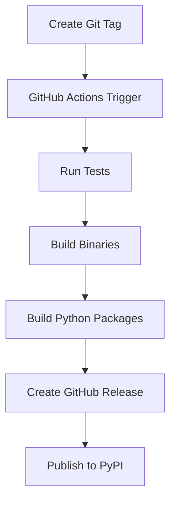

# 🚀 AWDX Release Process Guide

## Overview

This document outlines the complete release process for AWDX, including both automated GitHub releases with binary downloads and PyPI package publishing.

## 🎯 Release Strategy

AWDX follows a **dual-distribution strategy**:

1. **GitHub Releases**: Binary downloads for all platforms (Linux, macOS, Windows)
2. **PyPI Packages**: Python wheel and source distributions
3. **Automated Workflows**: GitHub Actions handle the entire process

## 📋 Prerequisites

### Required Tools
- Python 3.8+
- Git with access to the repository
- GitHub account with repository access
- PyPI account (for package publishing)

### Required Secrets
The following GitHub secrets must be configured in your repository:

1. **`PYPI_API_TOKEN`**: Your PyPI API token for publishing packages
2. **`GITHUB_TOKEN`**: Automatically provided by GitHub Actions

### Setup Instructions
1. Go to your GitHub repository → Settings → Secrets and variables → Actions
2. Add `PYPI_API_TOKEN` with your PyPI API token
3. Ensure the repository has Actions enabled

## 🔄 Release Workflow

### 1. Automated Release Process

The release process is fully automated through GitHub Actions:



### 2. Manual Release Process

For manual releases or testing:

```bash
# Run the release script
./scripts/release.sh

# Or with specific options
./scripts/release.sh --minor --skip-tests
```

## 🛠️ Release Script Usage

### Basic Usage
```bash
# Patch release (default)
./scripts/release.sh

# Minor release
./scripts/release.sh --minor

# Major release
./scripts/release.sh --major

# Skip tests (for quick releases)
./scripts/release.sh --skip-tests

# Skip building (for testing only)
./scripts/release.sh --skip-build
```

### Script Options
- `--major`: Bump major version (X.0.0)
- `--minor`: Bump minor version (0.X.0)
- `--patch`: Bump patch version (0.0.X)
- `--skip-tests`: Skip running the test suite
- `--skip-build`: Skip building packages and binaries
- `--help`: Show help message

## 🔨 Building Binaries

### Supported Platforms
- **Linux**: x86_64, aarch64
- **macOS**: x86_64, aarch64 (Apple Silicon)
- **Windows**: x86_64, aarch64

### Binary Naming Convention
```
awdx-{platform}-{architecture}
awdx-{platform}-{architecture}.exe  # Windows only
```

Examples:
- `awdx-linux-x86_64`
- `awdx-macos-aarch64`
- `awdx-windows-x86_64.exe`

### PyInstaller Configuration
The `awdx.spec` file is optimized for:
- Single-file executables
- Minimal dependency inclusion
- Platform-specific optimizations
- UPX compression (when available)

## 📦 Package Distribution

### GitHub Releases
- **Binary Downloads**: All platform binaries
- **Source Code**: ZIP and TAR.GZ archives
- **Release Notes**: Auto-generated with changelog
- **Assets**: Python packages (wheel + source)

### PyPI Packages
- **Wheel Distribution**: Optimized binary package
- **Source Distribution**: Complete source code
- **Metadata**: Project information and dependencies

## 🧪 Quality Assurance

### Pre-Release Testing
1. **Security Scanning**: Bandit, Safety, custom scanners
2. **Unit Tests**: All core functionality
3. **Integration Tests**: AWS service interactions
4. **Code Quality**: Black, Flake8, MyPy, Pylint
5. **Binary Testing**: Verify binary functionality

### Test Coverage Requirements
- **Minimum Coverage**: 80%
- **Security Score**: >95%
- **All Tests**: Must pass
- **Binary Tests**: Must pass on all platforms

## 🚀 Release Process Steps

### Step 1: Prepare Release
```bash
# Ensure all tests pass
python tests/run_tests.py --all --coverage

# Check security
python tests/security_scanner.py --quick

# Verify current version
grep 'version = ' pyproject.toml
```

### Step 2: Create Release
```bash
# Automatic release (recommended)
git tag v0.0.17
git push origin v0.0.17

# Manual release
./scripts/release.sh --patch
```

### Step 3: Monitor Progress
1. Check GitHub Actions: [Actions Tab](https://github.com/pxkundu/awdx/actions)
2. Monitor build progress for each platform
3. Verify binary creation and testing
4. Check release creation

### Step 4: Verify Release
1. **GitHub Releases**: Check binaries and assets
2. **PyPI**: Verify package availability
3. **Binary Testing**: Download and test binaries
4. **Documentation**: Update release notes if needed

## 📊 Release Metrics

### Success Criteria
- ✅ All tests pass
- ✅ Security score >95%
- ✅ Test coverage >80%
- ✅ Binaries built for all platforms
- ✅ GitHub release created
- ✅ PyPI package published

### Performance Metrics
- **Build Time**: <30 minutes total
- **Binary Size**: <50MB per platform
- **Test Execution**: <10 minutes
- **Release Creation**: <5 minutes

## 🔧 Troubleshooting

### Common Issues

#### Build Failures
```bash
# Check PyInstaller installation
pip install --upgrade pyinstaller

# Verify spec file
pyinstaller awdx.spec --dry-run

# Check dependencies
pip install -e ".[test]"
```

#### Test Failures
```bash
# Run specific test categories
python tests/run_tests.py --unit
python tests/run_tests.py --security

# Debug specific tests
pytest tests/test_ai_integration.py -v -s
```

#### Binary Issues
```bash
# Test binary locally
./dist/awdx --version
./dist/awdx --help

# Check binary dependencies
ldd ./dist/awdx  # Linux
otool -L ./dist/awdx  # macOS
```

### Recovery Procedures

#### Failed Release
1. Delete the git tag: `git tag -d v0.0.17`
2. Remove remote tag: `git push origin :refs/tags/v0.0.17`
3. Fix issues and retry

#### Partial Build
1. Check GitHub Actions logs
2. Identify failed platform
3. Re-run specific job or entire workflow

## 📚 Best Practices

### Release Frequency
- **Patch Releases**: Weekly (bug fixes)
- **Minor Releases**: Monthly (new features)
- **Major Releases**: Quarterly (breaking changes)

### Version Management
- Follow [Semantic Versioning](https://semver.org/)
- Use conventional commit messages
- Maintain changelog for each release

### Quality Gates
- Never release with failing tests
- Always run security scans
- Verify binary functionality
- Test on multiple platforms

## 🔗 Useful Links

- [GitHub Actions](https://github.com/pxkundu/awdx/actions)
- [Releases Page](https://github.com/pxkundu/awdx/releases)
- [PyPI Package](https://pypi.org/project/awdx/)
- [Test Results](https://github.com/pxkundu/awdx/actions/workflows/release.yml)

## 📞 Support

For release-related issues:
1. Check GitHub Actions logs
2. Review this documentation
3. Open an issue with `release` label
4. Contact the AWDX team

---

**Last Updated**: December 2024  
**Version**: 1.0  
**Maintainer**: AWDX Team
